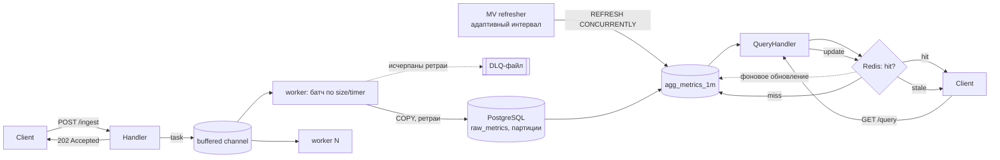

# FlowGate

Высокопроизводительный пайплайн приёма и агрегации потоковой телеметрии на Go: HTTP-приём с немедленным подтверждением, асинхронная запись в PostgreSQL батчами, адаптивно обновляемые материализованные представления для быстрой аналитики, кэширование в Redis.

## Архитектура



*Поток приёма и поток чтения независимы. Приём никогда не ждёт запись в БД (202 отдаётся сразу после постановки в канал), а чтение никогда не бьёт по `raw_metrics`
.*

## Установка и запуск

### Требования

- [Docker](https://www.docker.com/products/docker-desktop/) и Docker Compose v2 (входит в Docker Desktop)
- [Go](https://go.dev/dl/) 1.27+ - только если хочешь запускать `go build`/`go test` вне контейнера
- Git

### Linux / macOS

```bash
git clone <URL-твоего-репозитория> flowgate
cd flowgate

cp .env.example .env               # опционально: подправь лимиты/таймауты

go mod tidy                        # подтягивает точные версии/хэши зависимостей
docker-compose up --build
```

### Windows
**PowerShell:**
```powershell
git clone https://github.com/nick1jesky/FlowGate.git flowgate
cd flowgate

Copy-Item .env.example .env

go mod tidy
docker-compose up --build
```

```powershell
curl.exe -X POST http://localhost:8080/api/v1/ingest `
  -H "Content-Type: application/json" `
  -d '[{"device_id":"d1","metric":"temp","value":21.5,"timestamp":"2026-08-30T10:00:00Z"}]'
```
### Проверка, что всё поднялось

```bash
docker-compose ps            # postgres/redis должны быть healthy
curl localhost:8080/healthz  # {"status":"ok"}
curl localhost:8080/readyz   # {"status":"ok"}
```

### Остановка

```bash
docker-compose down
```
```bash
docker-compose down -v       
```

## Использование (примеры)

```bash
# Приём точек телеметрии - 202 сразу, запись в БД асинхронно
curl -X POST localhost:8080/api/v1/ingest \
  -H 'Content-Type: application/json' \
  -d '[{"device_id":"d1","metric":"temp","value":21.5,"timestamp":"2026-08-30T10:00:00Z"}]'

# Агрегаты за период (появятся после ближайшего рефреша MV - по умолчанию до 60с)
curl 'localhost:8080/api/v1/query?device_id=d1&from=2026-08-30T00:00:00Z&to=2026-08-30T23:59:59Z'

# Список известных устройств
curl localhost:8080/api/v1/devices

# Статистика dead-letter очереди (сколько батчей потеряно после ретраев)
curl localhost:8080/api/v1/dlq/stats

# Liveness / readiness (для оркестратора - без auth и rate-limit)
curl localhost:8080/healthz
curl localhost:8080/readyz

# Prometheus-метрики
curl localhost:8080/metrics | grep flowgate_
```

Если задан `API_KEYS` в `.env` - `-H 'X-API-Key: <ключ>'` к запросам под `/api/v1/*`.

* **Swagger UI:** `http://localhost:8080/docs` 
* **Grafana:** `http://localhost:3000` дашборд **FlowGate** подключается автоматически.

* **Prometheus:** `http://localhost:9090`


## Тесты

```bash
go test ./...                                        # unit-тесты, без Docker
go test -tags=integration ./internal/storage/...      # интеграционный тест
```

## Наблюдаемость

- `/metrics` - Prometheus (ingest rate, latency батчей, глубина канала, hit/stale/miss кэша, интервал MV-рефреша, состояние пула соединений, ретраи/DLQ/паники воркеров)
- Grafana-дашборд **FlowGate** - визуализация всего перечисленного, поднимается вместе с `docker-compose up`
- `/healthz`, `/readyz` - для liveness/readiness проб оркестратора
- `/docs`, `/openapi.yaml` - API-документация


## Лицензия

См. [LICENSE](LICENSE).
